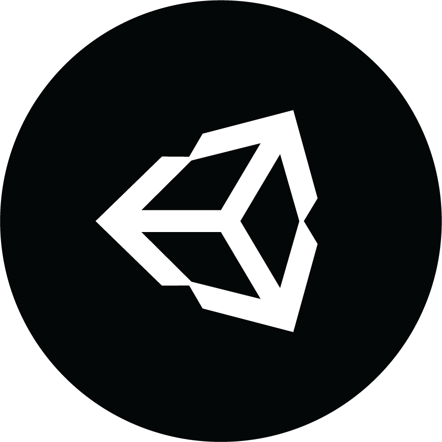
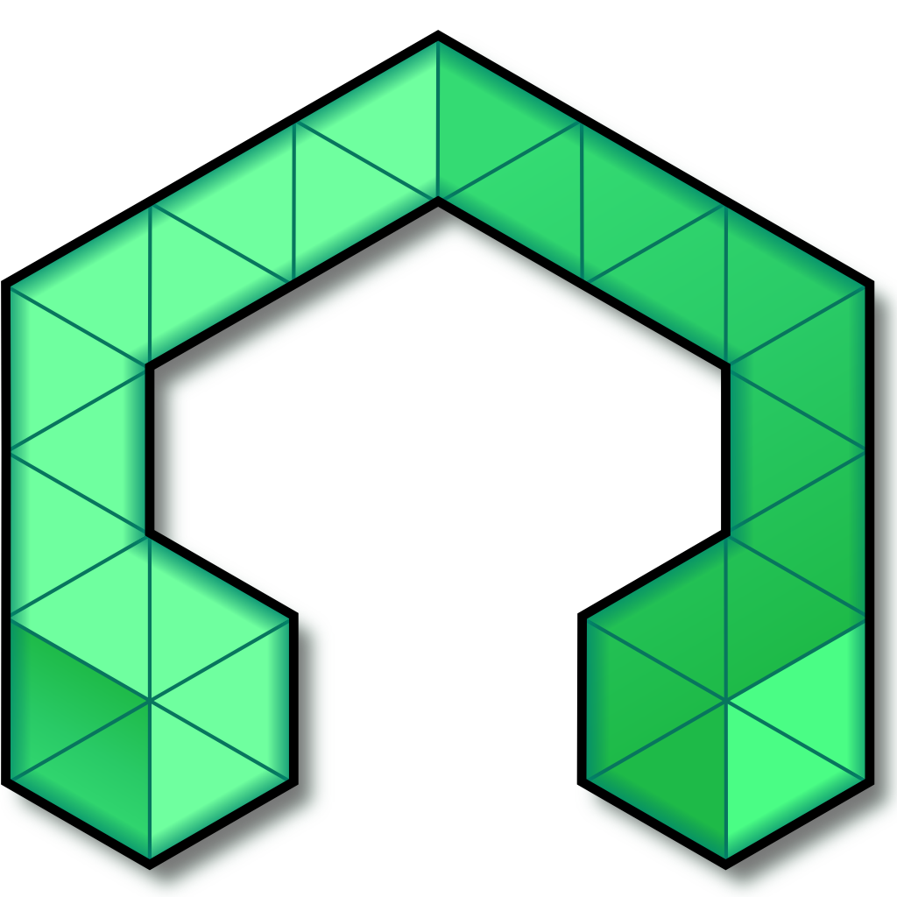

# Skills

## Game dev

## Unity Engine // Godot Engine

>Godot Engine logo

>Unity Engine logo

***
----------------> [Video: Projects](https://vimeo.com/user130645208)

----------------> [Project test: UnityGrandMap](https://github.com/caiosantosSTL/UnityGrandMap)

----------------> [Project test: Godot3DProjectoDu](https://github.com/caiosantosSTL/Godot3DProjectoDu)

## Blender 

***
----------------> [Blender projects](https://www.deviantart.com/redenalux)

## Web dev

***

## Frameworks

>Laravel

***

>Django

***
## Bonus

***

## LMMS

----------------> [LMMS projects](https://soundcloud.com/caiosds)