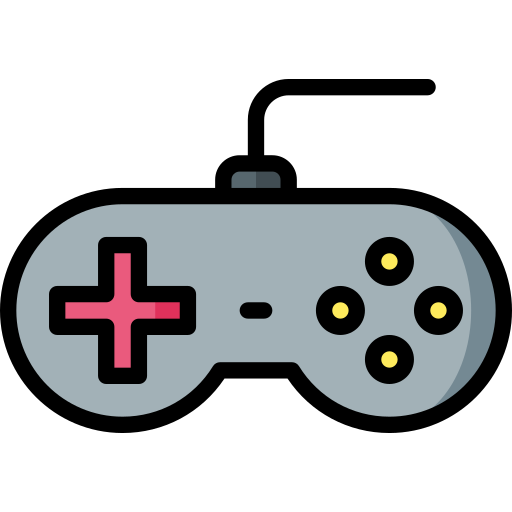

# Skills

## Game dev

## Unity Engine // Godot Engine

> Godot Engine logo

> Unity Engine logo

***

----------------> [Video: Projects](https://vimeo.com/user130645208)

----------------> [Project test: UnityGrandMap](https://github.com/caiosantosSTL/UnityGrandMap)

----------------> [Project test: Godot3DProjectoDu](https://github.com/caiosantosSTL/Godot3DProjectoDu)

## Blender

***

----------------> [Blender projects](https://www.deviantart.com/redenalux)

## Web dev

***

## Frameworks

> Laravel

***

> Django

***

## Bonus

***

## LMMS

----------------> [LMMS projects](https://soundcloud.com/caiosds)